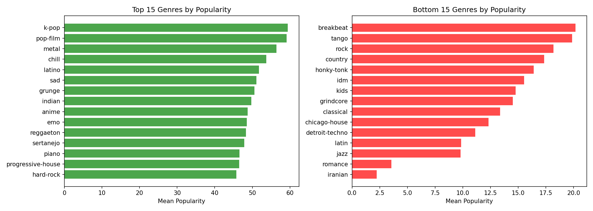

# Spotify EDA Project

Exploratory Data Analysis on Spotify Tracks Dataset (114K+ tracks, 113 genres).

## Key Findings
- K-pop and Pop-film are most popular genres
- Explicit songs are significantly more popular
- Energy and loudness strongly correlated (r=0.76)
- Popularity not driven by audio features alone

## Tech Stack
- Python, Pandas, NumPy
- Matplotlib, Seaborn
- SciPy (statistical tests)

## Structure
```
├── data/
│   └── cleaned_spotify_data.csv
├── notebooks/
│   └── eda_analysis.ipynb
├── images/
│   └── *.png (visualizations)
└── README.md
```

## Visualizations


